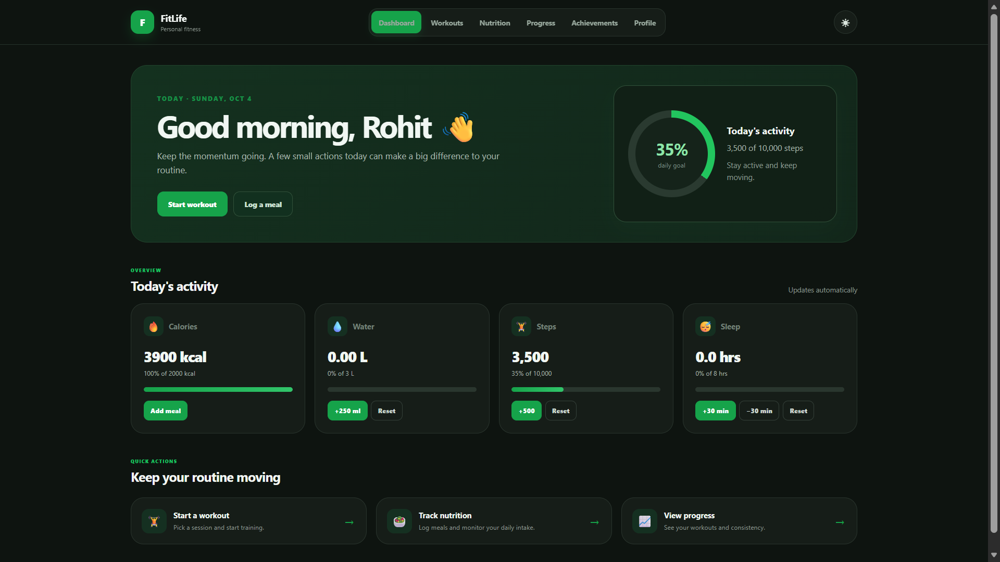
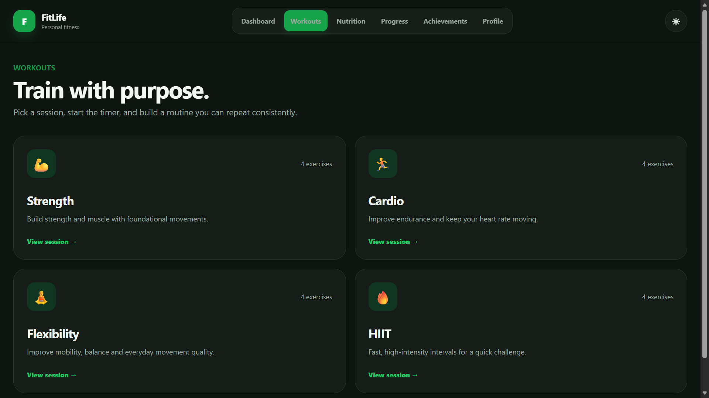
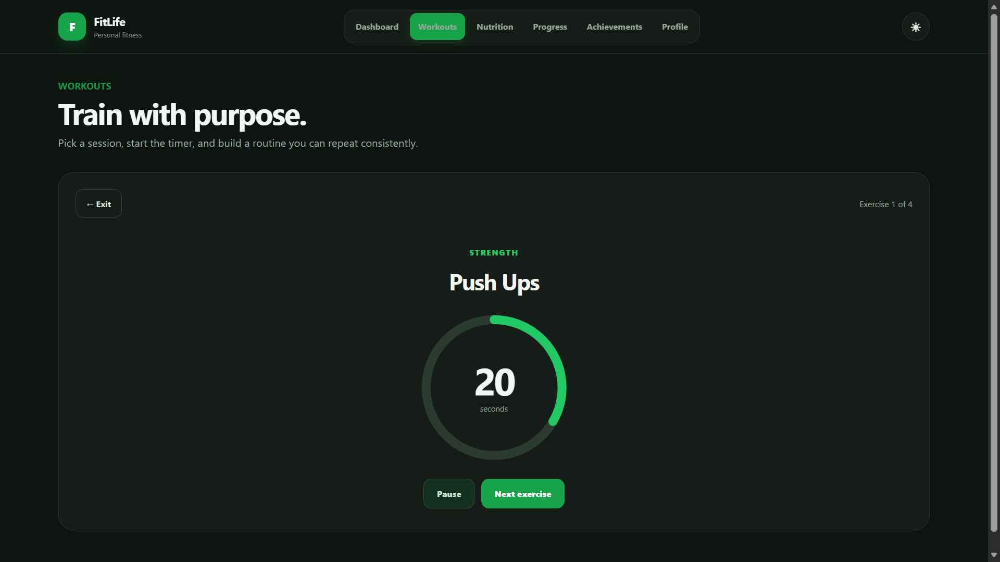
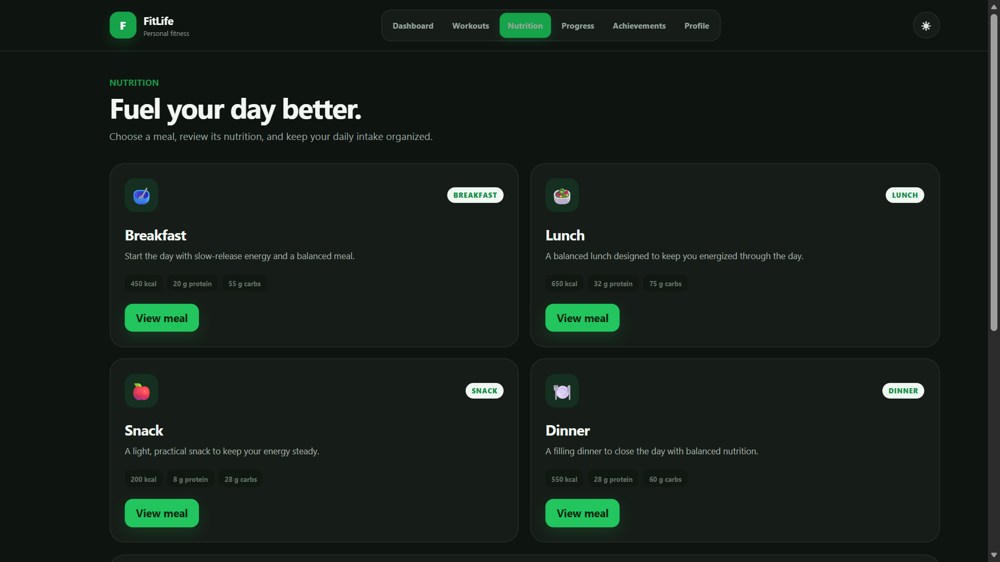
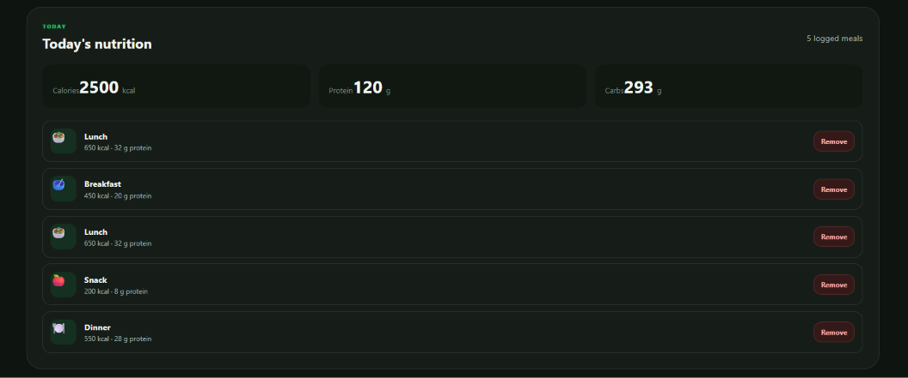
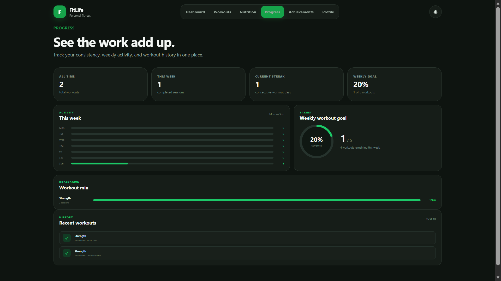
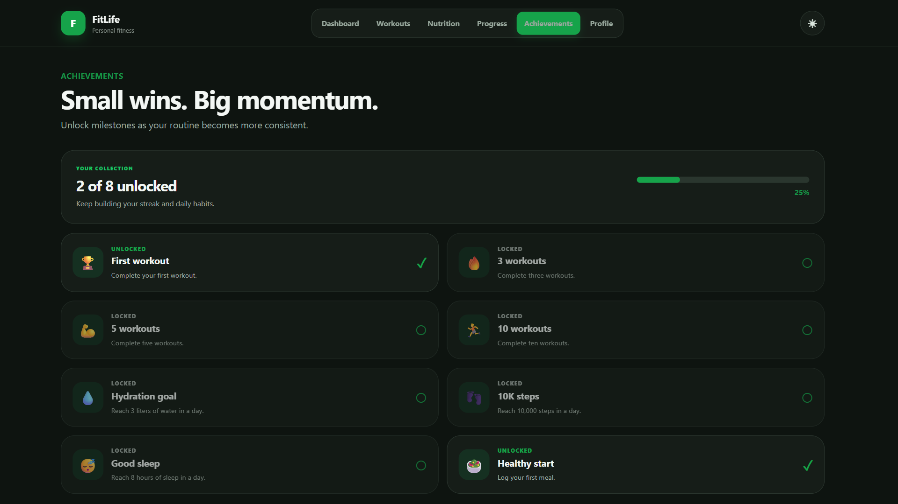
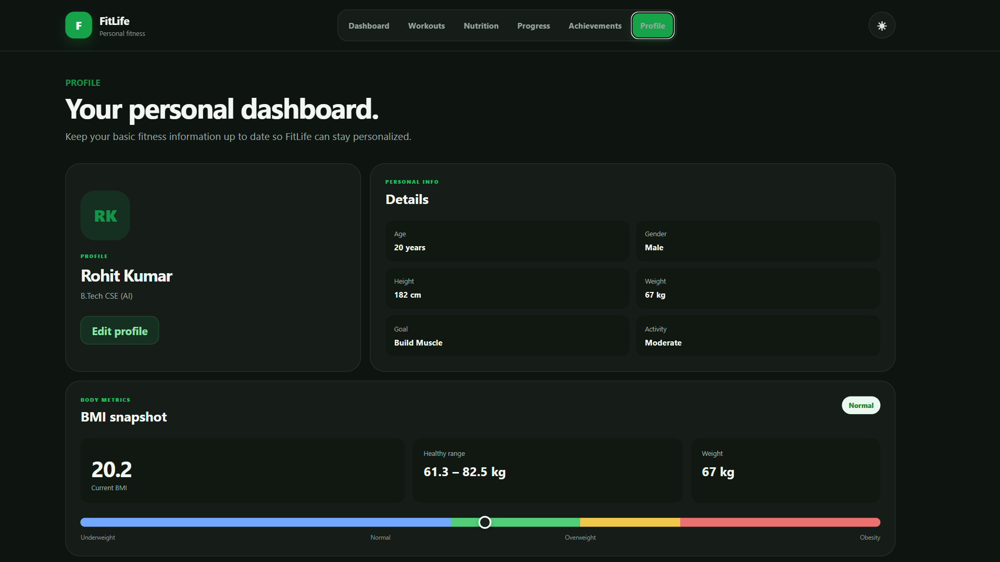

# FitLife — Personal Fitness & Wellness Dashboard

<p align="center">
  <strong>A modern, responsive fitness web application for tracking workouts, nutrition, hydration, sleep, steps, progress, and personal fitness goals.</strong>
</p>

<p align="center">
  <a href="https://github.com/Rohit-Kumar-AI/FitLife">GitHub Repository</a>
  ·
  <a href="https://github.com/Rohit-Kumar-AI">GitHub Profile</a>
</p>

---

## 📌 Overview

**FitLife** is a fitness tracking web application that brings everyday workout and wellness tracking into one clean dashboard.

Users can track workouts, meals, water, sleep, steps, progress, achievements, and personal fitness information through a responsive React interface.

## ✨ Key Features

- 🏠 Personalized fitness dashboard
- 🏋️ Strength, Cardio, Flexibility and HIIT workouts
- ⏱️ Guided workout timer with pause and next-exercise controls
- 🥗 Breakfast, lunch, snack and dinner nutrition plans
- 🍽️ Daily meal logging with calories, protein and carbs
- 💧 Water intake tracking
- 😴 Sleep tracking
- 👟 Step tracking
- 📈 Workout history, weekly activity and streak tracking
- 🏆 Achievement and milestone system
- 👤 Editable fitness profile
- ⚖️ BMI calculation and healthy weight range
- 🌙 Dark/light theme
- 💾 LocalStorage persistence
- 🔄 Automatic daily reset for daily metrics
- 📱 Responsive UI

---

## 🖥️ Screenshots

### 🏠 Dashboard

<p align="center">
  
</p>

### 🏋️ Workouts

<p align="center">
  
</p>

### ⏱️ Workout Timer

<p align="center">
  
</p>

### 🥗 Nutrition

<p align="center">
  
</p>

### 🍽️ Today's Nutrition

<p align="center">
  
</p>

### 📈 Progress

<p align="center">
  
</p>

### 🏆 Achievements

<p align="center">
  
</p>

### 👤 Profile

<p align="center">
  
</p>

---

## 🛠️ Tech Stack

| Technology | Purpose |
|---|---|
| React | Frontend UI |
| Vite | Development server and build tool |
| JavaScript (ES6+) | Application logic |
| HTML5 | Page structure |
| CSS3 | Styling and responsive design |
| LocalStorage | Client-side data persistence |
| Git & GitHub | Version control |

---

## 🧩 Project Structure

```text
FitLife/
└── frontend/
    ├── src/
    │   ├── components/
    │   │   ├── Navbar.jsx
    │   │   └── Navbar.css
    │   ├── pages/
    │   │   ├── Achievements.jsx
    │   │   ├── Achievements.css
    │   │   ├── Diet.jsx
    │   │   ├── Diet.css
    │   │   ├── Home.jsx
    │   │   ├── Home.css
    │   │   ├── Profile.jsx
    │   │   ├── Profile.css
    │   │   ├── Progress.jsx
    │   │   ├── Progress.css
    │   │   ├── Workout.jsx
    │   │   └── Workout.css
    │   ├── App.jsx
    │   ├── index.css
    │   └── main.jsx
    ├── index.html
    ├── package.json
    ├── package-lock.json
    └── vite.config.js
```

---

## 🚀 Run Locally

```bash
git clone https://github.com/Rohit-Kumar-AI/FitLife.git
cd FitLife/frontend
npm install
npm run dev
```

Open the Vite URL shown in the terminal, normally:

```text
http://localhost:5173/
```

---

## 💾 Data Persistence

FitLife uses browser **LocalStorage** for client-side persistence.

Stored data includes:

- Daily nutrition
- Logged meals
- Water intake
- Sleep
- Steps
- Workout history
- Theme preference
- Daily date state

Daily metrics automatically reset when a new day begins, while workout history remains available for progress tracking.

---

## 🎯 Design Goals

FitLife was designed to be:

- **Simple** — important information is easy to find
- **Practical** — focused on real fitness tracking workflows
- **Responsive** — works across desktop and smaller screens
- **Consistent** — shared visual design across all pages
- **Maintainable** — organized React components and page styles
- **Interactive** — progress indicators and actions update immediately

---

## 🔮 Future Improvements

- Backend authentication
- PostgreSQL/cloud database
- User accounts and cloud sync
- AI-powered workout recommendations
- AI meal recommendations
- Personalized calorie targets
- Long-term progress charts
- Exercise videos/illustrations
- Notifications and reminders
- PWA/mobile app support
- Health-device integration

---

## 👨‍💻 Author

**Rohit Kumar**

B.Tech — Computer Science & Engineering (Artificial Intelligence)

- GitHub: https://github.com/Rohit-Kumar-AI
- LinkedIn: https://www.linkedin.com/in/rohit-k-ai/
- LeetCode: https://leetcode.com/u/Rohit_ai/

---

## ⭐ Project

If you find **FitLife** useful or interesting, consider giving the repository a ⭐ on GitHub.

<p align="center">
  <strong>Built with React + Vite ❤️</strong>
</p>
